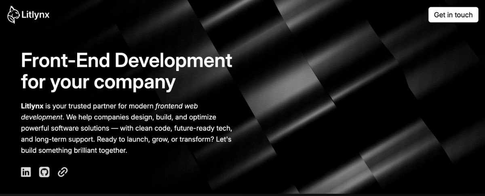

# LitLynx Website

[](https://astro.build/) [](https://vuejs.org/) [](https://tailwindcss.com/)[](./LICENSE)[](https://pnpm.io/)

This is the official website for LitLynx, built with [Astro](https://astro.build/), [Vue](https://vuejs.org/guide/introduction.html), and [Tailwind CSS](https://tailwindcss.com/).



## ✨ Features

- **Astro + Vue Integration**: Use Vue components seamlessly within Astro pages.
- **ScrollStack Animated Stats**: Interactive stats section powered by a custom ScrollStack Vue component.
- **Dark Theme**: Consistent dark mode styling using Tailwind's neutral color palette.
- **Optimized Image Handling**: Astro image imports passed as props to Vue components for best performance.
- **Responsive Design**: Mobile-first layouts and adaptive grids.
- **Services Section**: Modern cards with neutral colors for all service offerings.
- **SEO Metadata**: Dynamic metadata from JSON for better search engine visibility.
- **Easy Customization**: Modular structure for fast updates and new features.

## 🚀 Project Structure

```
├── public/           # Static assets (images, icons, etc.)
├── src/
│   ├── assets/       # Project images and SVGs
│   ├── components/   # Astro & Vue components
│   ├── data/         # JSON data files
│   ├── layouts/      # Layout components
│   ├── pages/        # Site pages (Astro)
│   ├── styles/       # Global styles (Tailwind)
│   └── utils/        # Utility scripts
├── astro.config.mjs  # Astro configuration
├── tailwind.config.mjs
├── tsconfig.json
├── package.json
└── README.md
```

## 🧑‍💻 Getting Started

Install dependencies:

```sh
pnpm install
```

Start the development server:

```sh
pnpm dev
```

Build for production:

```sh
pnpm build
```

Preview the production build:

```sh
pnpm preview
```

## 🧞 Commands

All commands are run from the root of the project, from a terminal:

| Command                | Action                                           |
| :--------------------- | :----------------------------------------------- |
| `pnpm install`         | Installs dependencies                            |
| `pnpm dev`             | Starts local dev server at `localhost:4321`      |
| `pnpm build`           | Build your production site to `./dist/`          |
| `pnpm preview`         | Preview your build locally, before deploying     |
| `pnpm astro ...`       | Run CLI commands like `astro add`, `astro check` |
| `pnpm astro -- --help` | Get help using the Astro CLI                     |

## 🌐 Learn More

- [Astro Documentation](https://docs.astro.build)
- [Vue Documentation](https://vuejs.org/guide/introduction.html)
- [Tailwind CSS Documentation](https://tailwindcss.com/docs)

---

© 2025 LitLynx. All rights reserved.
